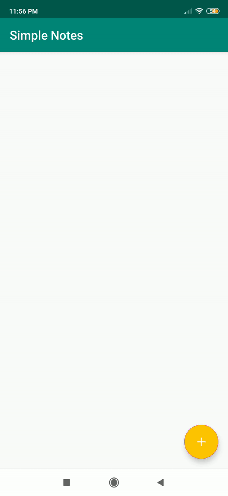
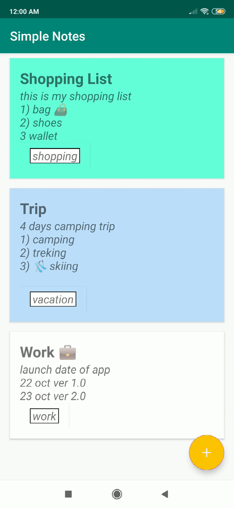

# Android Study Jam

Problem Statement :

Now-a-days everything has went online. People face problem in remembering their activities in their day to day life. Technology plays a vital role in day-to-day life activities which in turns made a great changes in many work fields and out of them Mobile Application is one of major developments. Mobile Application can be used effectively for this job as they are widely used and are known for easy access.

Proposed Solution:

This project proposed a "Notes App" to keep notes of your important things.
🗒️ Notes app is used for making short text notes,📝 updating when you need them, and ❌trashing
when you are done. It can be used for various functions as you can add your to-do list in this
app, some important notes for future reference, etc. The app is very useful in some cases like
when you want quick access to the notes. Likewise, here let’s create an Android App to learn
how to create a simple Notes app.

<h4>Features</h4>
<ul>
  <li>Add Note</li>
   <li>Delete Note</li>
   <li>Edit Note</li>
  </ul>

<h4>Screenshots</h4>
<table>
<thead>
<tr>
<th align="center">Add Notes</th>
<th align="center">Edit Notes</th>
<th align="center">Delete Notes</th>
</tr>
</thead>
<tbody>
<tr>
<td> </td>
<td> </td>
<td> </td>
</tr>
</tbody>
</table>

<h4>Architecture</h4>

MVVM is one of the architectural patterns which enhances separation of concerns, it allows
separating the user interface logic from the business (or the back-end) logic. Its target 
(with other MVC patterns goal) is to achieve the following principle “Keeping UI code simple 
and free of app logic in order to make it easier to manage”.

<ul>
<li>Lifecycles: It manages activity and fragment lifecycles of our app, survives configuration changes,
avoids memory leaks and easily loads data into our UI.</li>
<li>LiveData: It notifies views of any database changes. Use LiveData to build data objects that notify views when
the underlying database changes.</li>
<li>Room: It is a SQLite object mapping library. Use it to Avoid boilerplate code and easily 
convert SQLite table data to Java objects. Room provides compile time checks of SQLite statements
and can return RxJava, Flowable and LiveData observables.</li>
<li>ViewModel: It manages UI-related data in a lifecycle-conscious way. It stores UI-related data
that isn't destroyed on app rotations.</li>
<li>Repository: The repository depends on a persistent data model and a remote backend data source.</li>

 

 <h4>Library used</h4>
<ul>
<li><a href="https://developer.android.com/topic/libraries/architecture/room" target="_blank">Room</a></li>
<li><a href="https://developer.android.com/topic/libraries/architecture/viewmodel" target="_blank">Viewmodel</a></li>
<li><a href="https://developer.android.com/topic/libraries/architecture/livedata">Livedata</a></li>
<li><a href="https://github.com/google/dagger" target="_blank">Dagger2</a></li>
<li><a href="https://github.com/google/dagger" target="_blank">Dagger Android</a></li>
<li><a href="https://developer.android.com/kotlin/coroutines" target="_blank">Coroutines</a></li>
<li><a href="https://material.io/develop/android/docs/getting-started/" target="_blank">Material library</a></li>
<li><a href="https://developer.android.com/guide/navigation/navigation-getting-started" target="_blank">Navigation Component</a></li>
  <li><a href="https://developer.android.com/guide/navigation/navigation-pass-data" target="_blank">Safe Args Plugin</a></li>
  
  
  
</ul>

